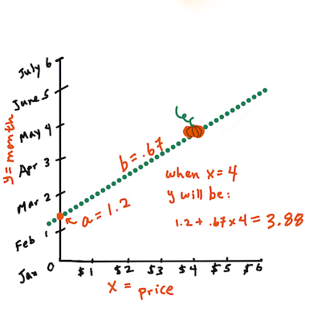
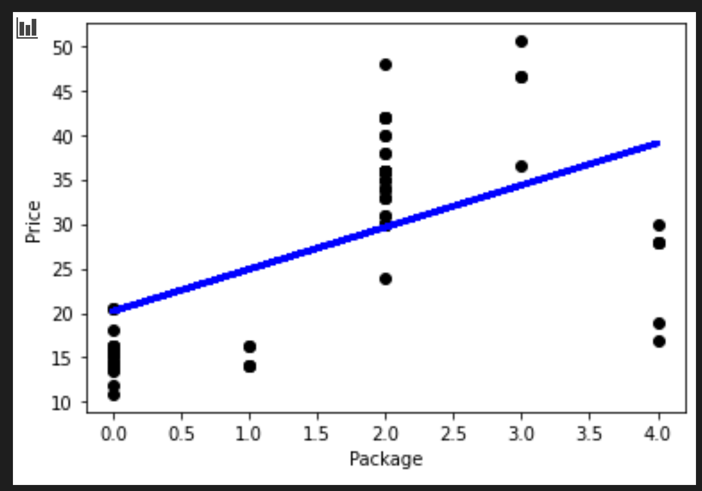

# 使用 Scikit-learn 構建回歸模型：兩種方式的回歸


> 作者 [Dasani Madipalli](https://twitter.com/dasani_decoded)

## [課前測](https://white-water-09ec41f0f.azurestaticapps.net/quiz/13/)

### 介紹

到目前為止，你已經通過從我們將在本課程中使用的南瓜定價數據集收集的樣本數據探索了什麽是回歸。你還使用 Matplotlib 對其進行了可視化。

現在你已準備好深入研究 ML 的回歸。 在本課中，你將詳細了解兩種類型的回歸：_基本線性回歸_ 和 _多項式回歸_，以及這些技術背後的一些數學知識。

> 在整個課程中，我們假設數學知識最少，並試圖讓來自其他領域的學生也能接觸到它，因此請使用筆記、🧮標註、圖表和其他學習工具以幫助理解。

### 前提

你現在應該熟悉我們正在檢查的南瓜數據的結構。你可以在本課的 _notebook.ipynb_ 文件中找到它。 在這個文件中，南瓜的價格顯示在一個新的 dataframe 中。確保可以在 Visual Studio Code 代碼的內核中運行這些 notebooks。

### 準備

提醒一下，你正在加載此數據以提出問題。

- 什麽時候買南瓜最好？
- 一箱微型南瓜的價格是多少？
- 我應該買半蒲式耳還是 1 1/9 蒲式耳？

讓我們繼續深入研究這些數據。

在上一課中，你創建了一個 Pandas dataframe 並用原始數據集的一部分填充它，按蒲式耳標準化定價。但是，通過這樣做，你只能收集大約 400 個數據點，而且只能收集秋季月份的數據。

看看我們在本課隨附的 notebook 中預加載的數據。數據已預加載，並繪製了初始散點圖以顯示月份數據。也許我們可以通過更多地清理數據來獲得更多關於數據性質的細節。

## 線性回歸線

正如你在第 1 課中學到的，線性回歸練習的目標是能夠繪製一條線以便：

- **顯示變量關系**。 顯示變量之間的關系
- **作出預測**。 準確預測新數據點與該線的關系。

繪製這種類型的線是**最小二乘回歸**的典型做法。術語「最小二乘法」意味著將回歸線周圍的所有數據點平方，然後相加。理想情況下，最終和盡可能小，因為我們希望錯誤數量較少，或「最小二乘法」。

我們這樣做是因為我們想要對一條與所有數據點的累積距離最小的線進行建模。我們還在添加它們之前對這些項進行平方，因為我們關心的是它的大小而不是它的方向。

> **🧮 數學知識**
>
> 這條線稱為 _最佳擬合線_，可以用[一個等式](https://en.wikipedia.org/wiki/Simple_linear_regression)表示：
>
> ```
> Y = a + bX
> ```
>
> `X` 是「解釋變量」。`Y` 是「因變量」。直線的斜率是 `b`，`a` 是 y 軸截距，指的是 `X = 0` 時 `Y` 的值。
>
>
>
> 首先，計算斜率 `b`。作者 [Jen Looper](https://twitter.com/jenlooper)
>
> 換句話說，參考我們的南瓜數據的原始問題：「按月預測每蒲式耳南瓜的價格」，`X` 指的是價格，`Y` 指的是銷售月份。
>
> 
>
> 計算 Y 的值。如果你支付大約 4 美元，那一定是四月！作者 [Jen Looper](https://twitter.com/jenlooper)
>
> 計算直線的數學必須證明直線的斜率，這也取決於截距，或者當 `X = 0` 時 `Y` 所在的位置。
>
> 你可以在 [Math is Fun](https://www.mathsisfun.com/data/least-squares-regression.html) 網站上觀察這些值的計算方法。另請訪問[這個最小二乘計算器](https://www.mathsisfun.com/data/least-squares-calculator.html)以觀察數字的值如何影響直線。

## 相關性

另一個需要理解的術語是給定 X 和 Y 變量之間的**相關系數**。使用散點圖，你可以快速可視化該系數。數據點散布在一條直線上的圖具有高相關性，但數據點散布在 X 和 Y 之間的圖具有低相關性。

一個好的線性回歸模型將是一個用最小二乘回歸法與直線回歸得到的高（更接近於 1）相關系數的模型。

✅ 運行本課隨附的 notebook 並查看 City to Price 散點圖。根據你對散點圖的視覺解釋，將南瓜銷售的城市與價格相關聯的數據似乎具有高相關性或低相關性？

## 為回歸準備數據

現在你已經了解了本練習背後的數學原理，可以創建一個回歸模型，看看你是否可以預測哪個南瓜包裝的南瓜價格最優惠。為節日購買南瓜的人可能希望此信息能夠優化他們如何購買南瓜包裝。

由於你將使用 Scikit-learn，因此沒有理由手動執行此操作（盡管你可以！）。在課程 notebook 的主要數據處理塊中，從 Scikit-learn 添加一個庫以自動將所有字符串數據轉換為數字：

```python
from sklearn.preprocessing import LabelEncoder

new_pumpkins.iloc[:, 0:-1] = new_pumpkins.iloc[:, 0:-1].apply(LabelEncoder().fit_transform)
```

如果你現在查看 new_pumpkins dataframe，你會看到所有字符串現在都是數字。這讓你更難閱讀，但對 Scikit-learn 來說更容易理解！

現在，你可以對最適合回歸的數據做出更有根據的決策（不僅僅是基於觀察散點圖）。

嘗試在數據的兩點之間找到良好的相關性，以構建良好的預測模型。事實證明，城市和價格之間只有微弱的相關性：

```python
print(new_pumpkins['City'].corr(new_pumpkins['Price']))
0.32363971816089226
```

然而，包裝和它的價格之間有更好的相關性。這是有道理的，對吧？通常，農產品箱越大，價格越高。

```python
print(new_pumpkins['Package'].corr(new_pumpkins['Price']))
0.6061712937226021
```

對這些數據提出的一個很好的問題是：「我可以期望給定的南瓜包裝的價格是多少？」

讓我們建立這個回歸模型

## 建立線性模型

在構建模型之前，再對數據進行一次整理。刪除任何空數據並再次檢查數據的樣子。

```python
new_pumpkins.dropna(inplace=True)
new_pumpkins.info()
```

然後，從這個最小集合創建一個新的 dataframe 並將其打印出來：

```python
new_columns = ['Package', 'Price']
lin_pumpkins = new_pumpkins.drop([c for c in new_pumpkins.columns if c not in new_columns], axis='columns')

lin_pumpkins
```

```output
	Package	Price
70	0	13.636364
71	0	16.363636
72	0	16.363636
73	0	15.454545
74	0	13.636364
...	...	...
1738	2	30.000000
1739	2	28.750000
1740	2	25.750000
1741	2	24.000000
1742	2	24.000000
415 rows × 2 columns
```

1. 現在你可以分配 X 和 y 坐標數據：

   ```python
   X = lin_pumpkins.values[:, :1]
   y = lin_pumpkins.values[:, 1:2]
   ```

✅ 這裏發生了什麽？你正在使用 [Python slice notation](https://stackoverflow.com/questions/509211/understanding-slice-notation/509295#509295) 來創建數組來填充 `X` 和 `y`。

2. 接下來，開始回歸模型構建例程：

   ```python
   from sklearn.linear_model import LinearRegression
   from sklearn.metrics import r2_score, mean_squared_error, mean_absolute_error
   from sklearn.model_selection import train_test_split

   X_train, X_test, y_train, y_test = train_test_split(X, y, test_size=0.2, random_state=0)
   lin_reg = LinearRegression()
   lin_reg.fit(X_train,y_train)

   pred = lin_reg.predict(X_test)

   accuracy_score = lin_reg.score(X_train,y_train)
   print('Model Accuracy: ', accuracy_score)
   ```

   因為相關性不是特別好，所以生成的模型不是非常準確。

   ```output
   Model Accuracy:  0.3315342327998987
   ```

3. 你可以將過程中繪製的線條可視化：

   ```python
   plt.scatter(X_test, y_test,  color='black')
   plt.plot(X_test, pred, color='blue', linewidth=3)

   plt.xlabel('Package')
   plt.ylabel('Price')

   plt.show()
   ```

   

4. 針對假設的品種測試模型：

   ```python
   lin_reg.predict( np.array([ [2.75] ]) )
   ```

   這個神話般的品種的價格是：

   ```output
   array([[33.15655975]])
   ```

如果回歸線的邏輯成立，這個數字是有意義的。

🎃 恭喜你，你剛剛創建了一個模型，可以幫助預測幾個南瓜品種的價格。你的節日南瓜地會很漂亮的。但是你可以創造一個更好的模型！

## 多項式回歸

另一種線性回歸是多項式回歸。雖然有時變量之間存在線性關系——南瓜的體積越大，價格就越高——但有時這些關系不能繪製成平面或直線。

✅ 這裏有可以使用多項式回歸數據的[更多示例](https://online.stat.psu.edu/stat501/lesson/9/9.8)

再看一下上圖中品種與價格之間的關系。這個散點圖看起來是否應該用一條直線來分析？也許不是。在這種情況下，你可以嘗試多項式回歸。

✅ 多項式是可能由一個或多個變量和系數組成的數學表達式

多項式回歸創建一條曲線以更好地擬合非線性數據。

1. 讓我們重新創建一個填充了原始南瓜數據片段的 dataframe：

   ```python
   new_columns = ['Variety', 'Package', 'City', 'Month', 'Price']
   poly_pumpkins = new_pumpkins.drop([c for c in new_pumpkins.columns if c not in new_columns], axis='columns')

   poly_pumpkins
   ```

可視化 dataframe 中數據之間相關性的一種好方法是將其顯示在「coolwarm」圖表中：

2. 使用 `Background_gradient()` 方法和 `coolwarm` 作為其參數值：

   ```python
   corr = poly_pumpkins.corr()
   corr.style.background_gradient(cmap='coolwarm')
   ```

   這段代碼創建了一個熱圖:
   

查看此圖表，你可以直觀地看到 Package 和 Price 之間的良好相關性。所以你應該能夠創建一個比上一個更好的模型。

### 創建管道

Scikit-learn 包含一個用於構建多項式回歸模型的有用 API - `make_pipeline` [API](https://scikit-learn.org/stable/modules/generated/sklearn.pipeline.make_pipeline.html?highlight=pipeline#sklearn.pipeline.make_pipeline)。 創建了一個「管道」，它是一個估計器鏈。在這種情況下，管道包括多項式特征或形成非線性路徑的預測。

1. 構建 X 和 y 列：

   ```python
   X=poly_pumpkins.iloc[:,3:4].values
   y=poly_pumpkins.iloc[:,4:5].values
   ```

2. 通過調用 `make_pipeline()` 方法創建管道：

   ```python
   from sklearn.preprocessing import PolynomialFeatures
   from sklearn.pipeline import make_pipeline

   pipeline = make_pipeline(PolynomialFeatures(4), LinearRegression())

   X_train, X_test, y_train, y_test = train_test_split(X, y, test_size=0.2, random_state=0)

   pipeline.fit(np.array(X_train), y_train)

   y_pred=pipeline.predict(X_test)
   ```

### 創建序列

此時，你需要使用_排序好的_數據創建一個新的 dataframe ，以便管道可以創建序列。

添加以下代碼：

   ```python
   df = pd.DataFrame({'x': X_test[:,0], 'y': y_pred[:,0]})
   df.sort_values(by='x',inplace = True)
   points = pd.DataFrame(df).to_numpy()

   plt.plot(points[:, 0], points[:, 1],color="blue", linewidth=3)
   plt.xlabel('Package')
   plt.ylabel('Price')
   plt.scatter(X,y, color="black")
   plt.show()
   ```

你通過調用 `pd.DataFrame` 創建了一個新的 dataframe。然後通過調用 `sort_values()` 對值進行排序。最後你創建了一個多項式圖：


你可以看到更適合你的數據的曲線。

讓我們檢查模型的準確性：

   ```python
   accuracy_score = pipeline.score(X_train,y_train)
   print('Model Accuracy: ', accuracy_score)
   ```

   瞧！

   ```output
   Model Accuracy:  0.8537946517073784
   ```

這樣好多了！試著預測一個價格：

### 做個預測

我們可以輸入一個新值並得到一個預測嗎？

調用 `predict()` 進行預測：

   ```python
   pipeline.predict( np.array([ [2.75] ]) )
   ```

   你會得到這樣的預測：

   ```output
   array([[46.34509342]])
   ```

參照圖像，這確實有道理！而且，如果這是一個比前一個更好的模型，看同樣的數據，你需要為這些更昂貴的南瓜做好預算！

🏆 幹得不錯！你在一節課中創建了兩個回歸模型。在回歸的最後一節中，你將了解邏輯回歸以確定類別。

---

## 🚀挑戰

在此 notebook 中測試幾個不同的變量，以查看相關性與模型準確性的對應關系。

## [課後測](https://white-water-09ec41f0f.azurestaticapps.net/quiz/14/)

## 復習與自學

在本課中，我們學習了線性回歸。還有其他重要的回歸類型。了解 Stepwise、Ridge、Lasso 和 Elasticnet 技術。學習更多信息的好課程是 [斯坦福統計學習課程](https://online.stanford.edu/courses/sohs-ystatslearning-statistical-learning)

## 任務

[構建模型](./assignment.zh-tw.md)
